# SAFEMRS: A Verifiable Neuro-Symbolic Cognitive Proxy for Safe Multi-Robot Autonomy with Triple-Channel Safety Verification

> A Verifiable Neuro-Symbolic Cognitive Proxy for Safe Language-Driven Multi-Robot Autonomy — integrating Triple-Channel Safety Verification, Agentic Reasoning, Multi-Formalism Planning (8 backends), and Real-Time Monitoring with PEFA Closed-Loop Adaptation

---

## 1. Motivation and Problem Statement

Heterogeneous multi-robot systems (HMRS) operating in **partially observable environments** face a fundamental tension: they must be flexible enough to interpret complex, ambiguous human commands, yet rigorous enough to guarantee safe execution across multiple robots with different capabilities. The expanded literature (46 papers, 2020–2025) reveals a rapidly growing field where individual safety mechanisms exist, but **no work integrates them end-to-end**:

- **LLM-based planners** (SMART-LLM, COHERENT, DART-LLM, LaMMA-P, CLGA, EmbodiedAgent) excel at task decomposition but lack formal safety guarantees.
- **Formal verification methods** (Webster et al., VerifyLLM, LTLCodeGen, NL2HLTL2PLAN) ensure correctness but are brittle against natural language ambiguity and do not provide runtime enforcement.
- **Runtime safety mechanisms** (SAFER with CBFs, S-ATLAS with conformal prediction) enforce execution-time safety but operate on isolated plans without agentic reasoning or multi-formalism planning.
- **Code generation paradigms** (Code as Policies, ProgPrompt, Code-as-Symbolic-Planner) produce executable robot policies but lack safety verification pipelines.
- **Multi-agent LLM architectures** (RoCo dialog, CLGA dual-process, FCRF reflection) improve planning quality through collaboration but do not address safety.
- **Hybrid LLM+RL approaches** (ICCO, Chen MAS+RL) combine language understanding with learned coordination but lack formal guarantees.
- **No existing framework** combines agentic LLM reasoning, external tool/resource access (MCP), multi-paradigm formal logic verification, runtime safety enforcement, and real-time monitoring into a unified architecture.

**We propose SAFEMRS** — a unified framework that bridges probabilistic LLM reasoning and rule-based formal verification within an agentic architecture, augmented by external resources and governed by a continuous safety and monitoring layer. SAFEMRS uniquely integrates CBF-based runtime enforcement, conformal prediction calibration, and formal logic verification into a single corroborative pipeline.

---

## 2. Conceptual Sketch

---

## 3. Architecture Overview

---

## 4. Detailed Component Description

### 4.1 Agentic Reasoning Layer (ARL)

The core intelligence layer receives natural language commands and orchestrates the entire planning pipeline through **agentic LLM reasoning** — an autonomous, multi-step reasoning process where the LLM iteratively plans, calls tools, and refines its output.

| Component                   | Role                                                                                                                                              |
| --------------------------- | ------------------------------------------------------------------------------------------------------------------------------------------------- |
| **LLM Reasoning Engine**    | Parses human intent via Chain-of-Thought (CoT) prompting; decomposes complex missions into structured sub-tasks with dependency annotations       |
| **Workflow Composer**       | Converts decomposed tasks into complex multi-step workflows; handles sequential, parallel, and conditional execution paths across multiple robots |
| **Abstract Planning Layer** | Technology-agnostic planning interface that can emit plans in multiple formalisms (see §4.5)                                                      |

> **Key difference from prior work**: Unlike SMART-LLM or COHERENT which use LLMs as monolithic planners, our ARL operates as an **autonomous agent** that iteratively refines plans through tool calls, safety checks, and external knowledge retrieval — mimicking the agentic loop paradigm.

---

### 4.2 MCP Tools & External Agents

The ARL is connected to external resources via the **Model Context Protocol (MCP)**, enabling:

| Resource Type          | Examples                                                                          |
| ---------------------- | --------------------------------------------------------------------------------- |
| **MCP Tool Servers**   | RESTful APIs, spatial databases, weather services, sensor data streams            |
| **External AI Agents** | Vision models for scene understanding, domain-specific planners, NLP translators  |
| **Knowledge Base**     | Domain ontology, robot capability registry, spatial maps, historical mission data |

> **Novelty**: No existing multi-robot LLM framework integrates MCP-based external tool access. Current systems (MultiBotGPT, AutoHMA-LLM) are closed-loop — they plan using only the LLM's internal knowledge. Our MCP integration enables **grounded, context-aware planning** by pulling real-world data at reasoning time.

---

### 4.3 Safety Reasoning Layer (SRL) — _Core Novelty_

The SRL combines **formal logic verification**, **probabilistic LLM safety reasoning**, and **runtime safety enforcement** into a triple-channel verification system that validates every plan before and during execution:

#### 4.3.1 Rule-Based Channel (Formal Verification)

| Component               | Description                                                                                                                                                |
| ----------------------- | ---------------------------------------------------------------------------------------------------------------------------------------------------------- |
| **LTL/CTL Translation** | Converts task specifications into temporal logic formulas using syntax-guaranteed generation (inspired by LTLCodeGen); supports hierarchical LTL (NL2HLTL2PLAN) for scalability |
| **Model Checking**      | Explores the state space of the multi-robot plan to verify that all temporal properties hold                                                               |
| **Deontic Logic**       | Encodes obligations (what robots _must_ do), prohibitions (what they _must not_ do), and permissions — extending SafePlan's societal/organizational layers |

#### 4.3.2 LLM-Based Channel (Probabilistic Safety Reasoning)

| Component                   | Description                                                                                                                                     |
| --------------------------- | ----------------------------------------------------------------------------------------------------------------------------------------------- |
| **Prompt Sanity Check**     | Multi-layer CoT screening (inspired by SafePlan) evaluating societal, organizational, and individual safety                                     |
| **Invariant Reasoner**      | Generates and verifies invariants, preconditions, and postconditions for each action in the plan                                                |
| **Conflict Reasoner**       | Detects resource conflicts (two robots needing the same tool), spatial conflicts (collision risk), and temporal conflicts (deadline violations) |
| **Conformal Prediction**    | Calibrates probabilistic bounds on plan success using conformal prediction (inspired by S-ATLAS), providing statistical safety guarantees without sacrificing flexibility |

#### 4.3.3 Runtime Enforcement Channel _(New — Beyond Pre-execution)_

| Component               | Description                                                                                                                                     |
| ----------------------- | ----------------------------------------------------------------------------------------------------------------------------------------------- |
| **Control Barrier Functions** | CBF-based runtime safety enforcement (inspired by SAFER) that maintains safety-critical constraints during execution — prevents robots from entering unsafe states even if the plan is nominally safe |
| **Execution Monitor**   | Continuous constraint violation detection during task execution, monitoring CBF values and safety margins                                       |
| **Adaptive Re-planning** | Safety-preserving recovery when the runtime monitor detects violations — triggers re-planning while maintaining CBF-guaranteed safety invariants |

#### 4.3.4 Corroborative Decision Fusion

Both pre-execution channels produce independent verdicts. A **corroborative fusion** mechanism (inspired by Webster et al.'s multi-faceted V&V) combines them:

- If **both agree safe** → execute with CBF runtime enforcement
- If **both agree unsafe** → reject with explanation
- If **they disagree** → escalate to human operator with detailed reasoning from both channels
- **Confidence-calibrated**: conformal prediction bounds inform the fusion threshold — high-uncertainty plans require stricter formal verification

> **Why this matters**: Pure formal verification misses common-sense hazards (e.g., placing a hot object near a child). Pure LLM reasoning hallucinates and lacks guarantees. CBF enforcement alone cannot prevent high-level planning errors. Our triple-channel approach provides **coverage** (LLM catches novel risks), **soundness** (formal logic prevents violations of known constraints), and **runtime resilience** (CBFs enforce safety during execution). No existing work (SAFER, S-ATLAS, SafePlan, VerifyLLM) combines all three.

---

### 4.4 Real-Time Monitoring Layer (RTM) — PEFA Closed-Loop

Unlike existing frameworks that plan once and execute blindly, our RTM implements a **PEFA (Proposal-Execution-Feedback-Adjustment) closed loop** — integrating concepts from LLM-CBT's closed-loop BT execution, CLGA's dual-process responsiveness, and DEXTER-LLM's online adaptation into a unified monitoring pipeline:

| Component               | Role                                                                                                                                                                        | PEFA Phase |
| ----------------------- | --------------------------------------------------------------------------------------------------------------------------------------------------------------------------- | ---------- |
| **State Aggregator**    | Fuses telemetry from all robots (pose, battery, task progress) with external data (sensor feeds via MCP, environmental changes) into a unified world state; integrates CBF safety margin values from the SRL Runtime Channel | **Feedback** |
| **Anomaly Detector**    | Monitors for execution drift — deviations from planned trajectories, unexpected obstacles, robot failures, CBF constraint violations, or environmental changes              | **Feedback** |
| **Re-Planning Trigger** | When anomalies exceed thresholds, triggers the Workflow Composer for dynamic re-planning through the same verified triple-channel pipeline (safety-preserving re-planning via CBF constraints) | **Adjustment** |

The PEFA loop formalizes the closed-loop cycle:

1. **Proposal**: ARL generates and SRL verifies a candidate plan
2. **Execution**: HAL dispatches the plan to the heterogeneous fleet via platform-specific adapters
3. **Feedback**: RTM continuously aggregates telemetry, detects anomalies, and monitors CBF safety margins
4. **Adjustment**: When drift or violations are detected, the RTM triggers re-planning through the full verified pipeline

The RTM feeds live state back to the ARL, enabling the LLM to make **informed decisions** based on current reality rather than stale assumptions. This closed-loop integration goes beyond DEXTER-LLM (which lacks formal safety), LLM-CBT (which lacks multi-formalism planning), and CLGA (which lacks runtime monitoring).

---

### 4.5 Abstract Planning Layer (Technology-Agnostic)

A critical architectural decision: the planning layer is **abstracted** behind a uniform interface, supporting multiple planning technologies:

| Technology                                              | Strengths                                                             | Use Case in SAFEMRS                                                                     | Inspired By            |
| ------------------------------------------------------- | --------------------------------------------------------------------- | --------------------------------------------------------------------------------------- | ---------------------- |
| **PDDL** (Planning Domain Definition Language)          | Mature, well-understood, efficient heuristic solvers (Fast Downward)  | Deterministic, fully-specified tasks with clear preconditions/effects                   | LaMMA-P, GMATP-LLM    |
| **Behavior Trees (BT)**                                 | Modular, reactive, easy to compose and modify at runtime              | Tasks requiring real-time reactivity and fallback behaviors                              | LLM-CBT, LAN2CB, Yuan, Hoffmeister |
| **DAG-based Plans**                                     | Explicit dependency modeling, natural parallelism                     | Tasks with complex inter-robot dependencies                                             | DART-LLM, LiP-LLM     |
| **Hierarchical Task Networks (HTN / HDDL 2.1)**         | Hierarchical decomposition with temporal support                      | Long-horizon missions requiring hierarchical abstraction                                | HDDL 2.1, EmbodiedAgent |
| **Signal Temporal Logic (STL)**                         | Continuous-time specifications, quantitative semantics               | Tasks with precise timing constraints and continuous safety requirements                | AutoTAMP               |
| **Finite State Machines (FSM)**                         | Structured state transitions, demonstration generation               | Sequential manipulation tasks, language-conditioned control policies                    | Mu et al.              |
| **Code Generation** (Python/symbolic)                   | Direct executability, spatial-geometric reasoning, composability     | Rapid policy generation, programmatic task plans with state assertions                  | Code as Policies, ProgPrompt, Code-as-Symbolic-Planner |
| **JSON/YAML Workflows**                                 | Human-readable, flexible, easy to integrate with MCP tools            | Rapid prototyping, simple coordination tasks, API-driven workflows                      | —                      |

The Abstract Planning Layer provides a **unified plan representation** that can be:

1. **Generated** by the LLM in any supported formalism
2. **Verified** by the Safety Reasoning Layer (formal channel validates LTL/STL specs; LLM channel validates code/BT semantics)
3. **Executed** by the robot fleet (with CBF runtime enforcement)
4. **Monitored** by the RTM

---

### 4.6 Hardware Abstraction Layer (HAL) — Middleware-Agnostic Proxy

A critical systems contribution: the HAL provides a **universal middleware bridge** that decouples the cognitive layers from platform-specific protocols, enabling SAFEMRS to orchestrate robots across disparate software stacks:

| Adapter                   | Protocol / Middleware       | Target Platforms                                                  |
| ------------------------- | --------------------------- | ----------------------------------------------------------------- |
| **ROS 2 Adapter**         | DDS (Data Distribution Service) | ROS 2 Humble / Jazzy robots (primary targets)                   |
| **ROS 1 Bridge**          | rosbridge / topic relay     | Legacy ROS 1 systems via `ros1_bridge`                            |
| **gRPC Adapter**          | Protocol Buffers over HTTP/2| Custom middleware, microservices-based robots                      |
| **MAVLink/MAVROS**        | MAVLink v2                  | PX4-based UAVs, ArduPilot platforms                               |
| **XRCE-DDS (Micro-ROS)**  | DDS-XRCE                   | Resource-constrained embedded systems (UUV microcontrollers)      |
| **VLA Execution Bridge**  | Action token → motor command| Vision-Language-Action models (e.g., RT-2) for fine-grained manipulation |

> **VLA Integration**: For tasks requiring fine-grained physical interaction (e.g., debris removal, survivor extraction), the VLA bridge translates high-level action commands + visual observations into direct motor tokens, bridging the gap between symbolic planning and continuous control. This is positioned as the "last mile" execution layer — the LLM plans, the VLA executes.

---

### 4.7 Multi-Robot System (MRS) — Embodiment-Aware Fleet

The robot fleet operates in a **partially observable environment** with embodiment-aware allocation via **Robot Resumes**:

| Feature                        | Description                                                                                                       |
| ------------------------------ | ----------------------------------------------------------------------------------------------------------------- |
| **Robot Resumes (URDF)**       | Each robot's URDF file is parsed to generate a textual "resume" summarizing its capabilities (payload, mobility, sensors, kinematic limits) — enabling the ARL to reason about hardware constraints during task allocation |
| **Skill Ontology**             | A structured mapping from task requirements (e.g., "navigate water", "lift 5kg") to robot capabilities, ensuring embodiment-aware reasoning |
| **Heterogeneous Capabilities** | Robots span diverse morphologies: UAVs (aerial), UGVs (ground), quadrupeds (rough terrain), UUVs (underwater), manipulators (grasping) |
| **Inter-Robot Communication**  | Robots share observations, coordinate handoffs, and report status through a peer-to-peer mesh                     |
| **Local Autonomy**             | Each robot has a local execution agent that interprets assigned sub-plans and handles low-level control (including VLA execution for fine-grained tasks) |
| **External Resource Access**   | Robots may (optionally) query external MCP tools for real-time information (maps, sensor feeds, databases)        |
| **Partial Observability**      | No single robot sees the full environment; the system must reason under uncertainty and fuse partial observations |

---

## 5. End-to-End Workflow

```mermaid
sequenceDiagram
    actor Human
    participant ARL as 🧠 Agentic Reasoning Layer
    participant MCP as 🔌 MCP Tools
    participant SRL as 🛡️ Safety Reasoning Layer
    participant MRS as 🤖 Multi-Robot System
    participant RTM as 📡 Real-Time Monitor

    Human->>ARL: Natural language command
    ARL->>MCP: Retrieve context (maps, capabilities, KB)
    MCP-->>ARL: Augmented context
    ARL->>ARL: CoT decomposition → sub-tasks + dependencies
    ARL->>ARL: Generate candidate plan (PDDL / BT / DAG)

    rect rgb(15, 52, 96)
        Note over ARL,SRL: Triple-Channel Safety Verification
        ARL->>SRL: Submit candidate plan
        SRL->>SRL: Formal Logic Check (LTL model checking)
        SRL->>SRL: LLM Safety CoT (invariants, conflicts)
        SRL-->>ARL: ✅ Verified plan (or ❌ with feedback)
    end

    alt Plan rejected
        ARL->>ARL: Refine plan using SRL feedback
        ARL->>SRL: Re-submit refined plan
    end

    ARL->>MRS: Send verified mission (augmented context)
    MRS->>MRS: Robots execute assigned sub-tasks
    MRS->>MRS: Inter-robot communication & coordination

    loop Continuous Monitoring
        MRS->>RTM: Telemetry & observations
        RTM->>RTM: Anomaly detection
        alt Anomaly detected
            RTM->>ARL: Re-planning trigger
            ARL->>ARL: Dynamic re-planning
            ARL->>SRL: Verify updated plan
            SRL-->>ARL: ✅ / ❌
            ARL->>MRS: Updated mission
        end
        RTM-->>ARL: Live world state
    end

    MRS-->>Human: Mission complete / status report
```

---

## 6. Contrast with Existing Literature

### 6.1 Feature Comparison Matrix

| Feature                           | SMART-LLM | COHERENT | DART-LLM | LaMMA-P | DEXTER-LLM | SafePlan | VerifyLLM | SAFER    | S-ATLAS  | LLM-CBT  | RoCo     | Code as Policies | NL2HLTL2PLAN | **SAFEMRS**               |
| --------------------------------- | --------- | -------- | -------- | ------- | ---------- | -------- | --------- | -------- | -------- | -------- | -------- | ---------------- | ------------ | ------------------------- |
| **Agentic LLM reasoning**         | ❌        | ❌       | ❌       | ❌      | Partial    | ❌       | ❌        | ❌       | ❌       | ❌       | ❌       | ❌               | ❌           | **✅**                    |
| **External tool access (MCP)**    | ❌        | ❌       | ❌       | ❌      | ❌         | ❌       | ❌        | ❌       | ❌       | ❌       | ❌       | ❌               | ❌           | **✅**                    |
| **Formal logic verification**     | ❌        | ❌       | ❌       | ❌      | ❌         | Partial  | ✅ (LTL)  | ❌       | ❌       | ❌       | ❌       | ❌               | ✅ (HLTL)    | **✅ (LTL+Deontic)**      |
| **LLM safety reasoning**          | ❌        | ❌       | ❌       | ❌      | ❌         | ✅       | ❌        | ❌       | ❌       | ❌       | ❌       | ❌               | ❌           | **✅**                    |
| **CBF runtime enforcement**       | ❌        | ❌       | ❌       | ❌      | ❌         | ❌       | ❌        | ✅       | ❌       | ❌       | ❌       | ❌               | ❌           | **✅**                    |
| **Probabilistic safety bounds**   | ❌        | ❌       | ❌       | ❌      | ❌         | ❌       | ❌        | ❌       | ✅       | ❌       | ❌       | ❌               | ❌           | **✅ (Conformal)**        |
| **Triple safety verification**    | ❌        | ❌       | ❌       | ❌      | ❌         | ❌       | ❌        | ❌       | ❌       | ❌       | ❌       | ❌               | ❌           | **✅ (Corroborative)**    |
| **Real-time monitoring**          | ❌        | ❌       | ❌       | ❌      | Partial    | ❌       | ❌        | Partial  | ❌       | Partial  | ❌       | ❌               | ❌           | **✅**                    |
| **Dynamic re-planning**           | ❌        | ❌       | ❌       | ❌      | ✅         | ❌       | ❌        | ❌       | ❌       | ✅       | ❌       | ❌               | ❌           | **✅**                    |
| **Heterogeneous robots**          | ✅        | ✅       | ✅       | ✅      | ✅         | ✅       | ❌        | ✅       | ✅       | ✅       | ✅       | ❌               | ✅           | **✅**                    |
| **Multi-agent LLM dialog**        | ❌        | ❌       | ❌       | ❌      | ❌         | ❌       | ❌        | ❌       | ❌       | ❌       | ✅       | ❌               | ❌           | **✅**                    |
| **Code generation planning**      | ❌        | ❌       | ❌       | ❌      | ❌         | ❌       | ❌        | ❌       | ❌       | ❌       | ❌       | ✅               | ❌           | **✅ (Multi-formalism)**  |
| **Multi-formalism planning**      | ❌        | ❌       | DAG      | PDDL    | ❌         | ❌       | ❌        | ❌       | ❌       | BT       | ❌       | Code             | LTL          | **✅ (8 backends)**       |
| **Dependency modeling**           | ❌        | ❌       | ✅ (DAG) | ❌      | ❌         | ❌       | ❌        | ❌       | ❌       | ❌       | ❌       | ❌               | ❌           | **✅ (Abstract)**         |
| **Partial observability**         | ❌        | ❌       | ❌       | ❌      | ✅         | ❌       | ❌        | ❌       | ❌       | ❌       | ❌       | ❌               | ❌           | **✅**                    |
| **Inter-robot communication**     | ❌        | ❌       | ❌       | ❌      | ❌         | ❌       | ❌        | ❌       | ❌       | ❌       | ✅       | ❌               | ❌           | **✅**                    |
| **VLA execution bridge**          | ❌        | ❌       | ❌       | ❌      | ❌         | ❌       | ❌        | ❌       | ❌       | ❌       | ❌       | Partial          | ❌           | **✅**                    |
| **HAL middleware abstraction**    | ❌        | ❌       | ❌       | ❌      | ❌         | ❌       | ❌        | ❌       | ❌       | ❌       | ❌       | ❌               | ❌           | **✅ (6 adapters)**       |
| **Embodiment-aware allocation**   | ❌        | ❌       | ❌       | ❌      | ❌         | ❌       | ❌        | ❌       | ❌       | ❌       | ❌       | ❌               | ❌           | **✅ (Robot Resumes)**   |

### 6.2 Positioning Against Key Related Works

#### vs. SMART-LLM / COHERENT (Task Decomposition)

These frameworks use LLMs for task decomposition and allocation but treat the LLM as a **single-shot planner** — the LLM generates a plan and hands it off. SAFEMRS introduces an **agentic loop** where the LLM iteratively refines plans through tool calls, safety verification feedback, and real-time state updates. Additionally, our MCP integration grounds the LLM's reasoning in external knowledge, reducing hallucination.

#### vs. DART-LLM / LiP-LLM (Dependency Modeling)

Both explicitly model task dependencies (DAGs) but are limited to that single formalism. SAFEMRS provides an **abstract planning layer** supporting 8 formalisms, allowing the system to choose the best representation for each mission type. Furthermore, neither includes safety verification or real-time monitoring.

#### vs. LaMMA-P / GMATP-LLM (LLM + Classical Planners)

These combine LLMs with PDDL solvers — a powerful pattern we adopt. However, they verify only plan **syntactic correctness** (PDDL validator) rather than **semantic safety**. SAFEMRS adds a full Safety Reasoning Layer that performs formal verification (LTL/CTL model checking), LLM-based safety reasoning (invariants, conflicts), and CBF runtime enforcement.

#### vs. SafePlan (Safety)

SafePlan introduces prompt-level safety screening and invariant reasoning — direct inspirations for our SRL. However, SafePlan operates only **pre-execution** and does not monitor runtime behavior. SAFEMRS extends this with: (1) formal logic verification as a complementary channel, (2) CBF runtime enforcement, (3) conformal prediction calibration, and (4) corroborative fusion of all channels.

#### vs. VerifyLLM / LTLCodeGen / NL2HLTL2PLAN (Formal Specifications)

VerifyLLM translates plans to LTL; LTLCodeGen guarantees syntactic correctness of LTL generation; NL2HLTL2PLAN scales temporal logic via hierarchical decomposition. We adopt these advances but extend them with: (1) deontic logic for obligations/prohibitions, (2) an LLM-based safety channel for common-sense reasoning, (3) CBF runtime enforcement beyond pre-execution verification, and (4) integration into a full agentic planning pipeline.

#### vs. DEXTER-LLM (Dynamic Re-planning)

DEXTER-LLM is closest to our vision in supporting dynamic online planning with human-in-the-loop. However, it lacks formal safety verification, MCP-based external tool access, CBF enforcement, and a structured monitoring layer. SAFEMRS provides a more complete architecture by integrating adaptive planning with formal safety guarantees.

#### vs. SAFER (CBF Runtime Safety)

SAFER pioneers the integration of LLMs with CBFs for runtime safety enforcement — a key inspiration for our Runtime Enforcement Channel. However, SAFER operates on isolated plans without formal pre-execution verification (LTL/deontic logic), multi-formalism planning, or agentic reasoning with external tool access. SAFEMRS integrates CBFs as one channel within a triple-channel verification pipeline.

#### vs. S-ATLAS (Probabilistic Guarantees)

S-ATLAS uses conformal prediction to provide probabilistic correctness bounds for LLM-generated multi-robot plans. We adopt this approach in our Conformal Prediction component but position it within a broader framework that also includes formal logic verification, LLM safety reasoning, and CBF runtime enforcement — providing both statistical and formal guarantees simultaneously.

#### vs. RoCo (Multi-Agent LLM Dialog)

RoCo's dialectic inter-robot LLM negotiation enables emergent collaborative strategies. SAFEMRS can incorporate RoCo-style dialog within its Agentic Reasoning Layer, but adds the critical missing element: **safety verification** of negotiated plans before execution. RoCo robots negotiate without safety constraints — SAFEMRS ensures all negotiated plans pass triple-channel verification.

#### vs. LLM-CBT (Closed-Loop BTs)

LLM-CBT generates closed-loop behavior trees for UAV-UGV swarms with dynamic re-planning — a direct inspiration for our BT backend and RTM design. However, LLM-CBT lacks formal verification, multi-formalism planning, and MCP-based external augmentation. SAFEMRS provides BTs as one option within a multi-formalism layer, verified by the SRL.

#### vs. Code as Policies / ProgPrompt (Code Generation)

These foundational works establish code generation as a robot control paradigm. SAFEMRS adopts code generation as one of 8 planning backends but critically adds **safety verification of generated code** — neither Code as Policies nor ProgPrompt validate generated code for safety beyond basic assertion checking.

#### vs. AutoHMA-LLM (Hybrid Architecture)

AutoHMA-LLM's cloud/device LLM split is complementary to our architecture — it could serve as the deployment topology for SAFEMRS's distributed agents. However, AutoHMA-LLM does not address safety verification or real-time monitoring.

---

## 7. Key Novel Contributions

> [!IMPORTANT]
> The following are the primary novelties of SAFEMRS that distinguish it from all 46 surveyed works:

### Novelty 1: Triple-Channel Safety Verification (Formal + Probabilistic + Runtime)

No existing framework combines **rule-based formal verification** (LTL/CTL model checking, deontic logic), **probabilistic LLM safety reasoning** (CoT invariant checking, conflict detection, conformal prediction), and **CBF-based runtime enforcement** into a single corroborative pipeline. SAFER provides CBFs but not formal logic; S-ATLAS provides conformal prediction but not runtime enforcement; SafePlan provides LLM reasoning but not formal verification. SAFEMRS integrates all three with confidence-calibrated fusion.

### Novelty 2: Agentic Reasoning with MCP-Based External Augmentation

Current multi-robot LLM planners (SMART-LLM, COHERENT, RoCo, Code as Policies) are closed-loop systems operating solely on the LLM's parametric knowledge. SAFEMRS introduces an **agentic reasoning paradigm** where the LLM autonomously calls external tools, retrieves real-world context, and consults domain-specific agents through the **Model Context Protocol (MCP)** — enabling grounded, context-aware mission planning.

### Novelty 3: Real-Time Monitoring with Safety-Preserving Re-Planning

While DEXTER-LLM and LLM-CBT support dynamic re-planning, no framework provides a structured **monitoring layer** that continuously fuses robot telemetry with environmental data, detects anomalies (including CBF constraint violations), and triggers re-planning through the same verified triple-channel pipeline. SAFEMRS closes the loop between planning and execution while maintaining formal safety guarantees during transitions.

### Novelty 4: Abstract Multi-Formalism Planning Layer (8 Backends)

Existing works commit to a single planning formalism — PDDL (LaMMA-P), behavior trees (LLM-CBT, LAN2CB), DAGs (DART-LLM), LTL (NL2HLTL2PLAN), STL (AutoTAMP), FSMs (Mu et al.), or code (Code as Policies). SAFEMRS introduces an **abstract planning interface** supporting all 8 behind a unified API — enabling formalism selection per task type.

### Novelty 5: Multi-Paradigm Safety Integration

SAFEMRS uniquely synthesizes safety mechanisms from across the literature into a unified architecture: CBFs from SAFER, conformal prediction from S-ATLAS, syntax-guaranteed LTL from LTLCodeGen, hierarchical specifications from NL2HLTL2PLAN, prompt safety screening from SafePlan, and sliding-window verification from VerifyLLM. No prior work integrates more than two of these mechanisms.

### Novelty 6: Embodiment-Aware Cognitive Proxy (HAL + VLA + Robot Resumes)

SAFEMRS acts as a **verifiable cognitive proxy** between human intent and heterogeneous robot execution. The Hardware Abstraction Layer (HAL) bridges 6 middleware protocols (ROS 1, ROS 2, gRPC, MAVLink, XRCE-DDS, VLA), while **Robot Resumes** (URDF-derived textual capability summaries) enable the ARL to reason about embodiment constraints during task allocation. The **VLA execution bridge** provides a "last mile" connection from symbolic plans to continuous motor control for fine-grained manipulation — a capability no existing multi-robot LLM framework addresses.

---

## 8. Research Questions

1. **RQ1**: How does triple-channel safety verification (formal + LLM-based + CBF runtime) compare to single- and dual-channel approaches in detecting plan hazards across diverse multi-robot scenarios?

2. **RQ2**: Does MCP-based external augmentation reduce LLM hallucination rates and improve task plan correctness in heterogeneous multi-robot systems?

3. **RQ3**: How does real-time monitoring with safety-preserving re-planning affect mission success rates in partially observable environments compared to static planning approaches?

4. **RQ4**: Can an abstract planning layer supporting 8 formalisms outperform single-formalism systems in terms of generalization across mission types and complexity levels?

5. **RQ5**: Does conformal prediction calibration improve the reliability of corroborative decision fusion compared to uncalibrated LLM confidence scores?

---

## 9. Proposed Evaluation Plan

| Dimension              | Method                                                                                                               | Metrics                                                                               |
| ---------------------- | -------------------------------------------------------------------------------------------------------------------- | ------------------------------------------------------------------------------------- |
| **Safety**             | Benchmark of safe/unsafe prompts (extending SafePlan's 621-prompt dataset) + injected plan faults + CBF constraint violations | Harmful prompt rejection rate, false positive rate, hazard detection coverage, CBF violation rate |
| **Planning Quality**   | MAT-THOR, VirtualHome, RoCoBench, LEMMA, custom heterogeneous robot scenarios                                        | Success rate (SR), Goal Condition Recall (GCR), Executability (Exe), Efficiency (Eff) |
| **Runtime Safety**     | Injected runtime perturbations (obstacle insertion, sensor noise, partial failures)                                    | CBF safety margin maintenance, conformal prediction coverage, constraint violation rate |
| **Dynamic Adaptation** | Scenarios with injected failures, obstacle changes, robot dropouts                                                    | Re-planning latency, recovery success rate, mission completion under perturbation     |
| **Scalability**        | 2–10 robots, increasing task complexity (per NL2HLTL2PLAN's scalability protocol)                                     | Planning time, communication overhead, success rate vs. robot count                   |
| **Manipulation**       | OBiMan-Bench, LEMMA tasks for bimanual and multi-arm coordination                                                    | Task completion rate, coordination quality, safety compliance                          |
| **Ablation**           | Remove each component (SRL channels, RTM, MCP, Planning backends) independently                                      | Contribution of each module to overall performance                                    |

---

## 10. Summary

SAFEMRS addresses thirteen critical gaps identified in the literature (46 papers, 2020–2025):

| Gap                                         | How SAFEMRS Addresses It                                                      |
| ------------------------------------------- | ----------------------------------------------------------------------------- |
| No unified safety verification              | Triple-channel (formal + LLM + CBF runtime) corroborative verification        |
| Closed-loop LLM planning                    | MCP-based external tool/knowledge augmentation                                |
| No runtime safety enforcement               | CBF-based enforcement maintaining safety sets during execution (from SAFER)   |
| No probabilistic safety bounds              | Conformal prediction calibration providing statistical guarantees (from S-ATLAS) |
| No runtime monitoring                       | Structured RTM with PEFA closed-loop (anomaly detection + safety-preserving re-planning) |
| Single planning formalism                   | Abstract layer supporting 8 backends (PDDL, BT, DAG, HTN, STL, FSM, Code, YAML) |
| Static plan execution                       | Dynamic re-planning triggered by real-time monitoring via verified pipeline   |
| No safety for code-generated plans          | Safety verification of generated code through formal + LLM channels           |
| Limited partial observability support       | Fused observations from multiple robots + external sensors via MCP            |
| Missing inter-robot communication           | Peer-to-peer robot coordination + multi-agent LLM dialog (inspired by RoCo)  |
| No middleware-agnostic execution            | HAL with 6 adapters (ROS 1, ROS 2, gRPC, MAVLink, XRCE-DDS, VLA)            |
| No embodiment-aware task allocation         | Robot Resumes (URDF-derived) enable capability-grounded reasoning             |
| No symbolic→continuous control bridge       | VLA execution bridge for fine-grained manipulation tasks                      |

By combining the strengths of agentic LLM reasoning, triple-channel safety verification, external resource augmentation, multi-formalism planning, embodiment-aware allocation via Robot Resumes, continuous monitoring with PEFA closed-loop adaptation, and a middleware-agnostic HAL with VLA execution, SAFEMRS provides the most comprehensive cognitive proxy architecture for safe, adaptive multi-robot task planning in partially observable environments.
