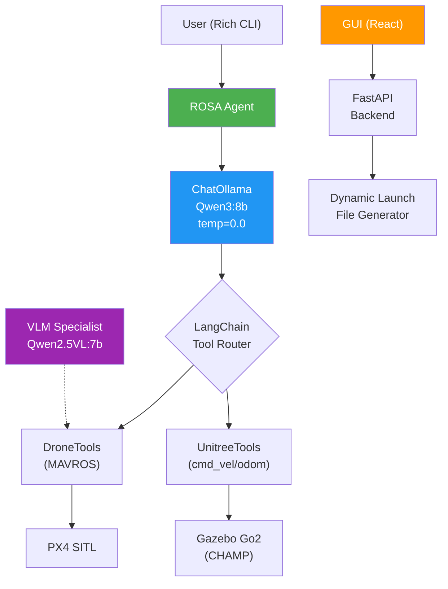
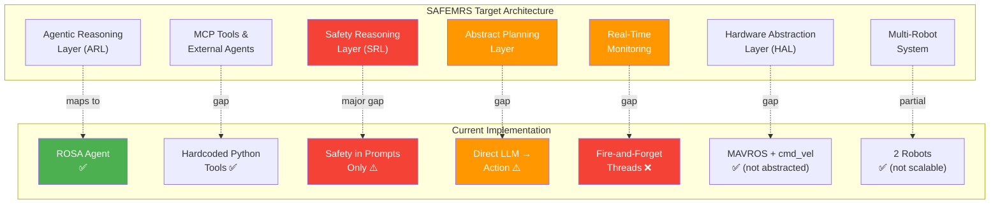

# SAFEMRS Integration Roadmap
## Gap Analysis: `ros2_agent_sim` → SAFEMRS Architecture

---

## 1. Repository Architecture Overview

### `ros2_agent_sim` — 6 ROS 2 Packages

| Package | Purpose | Key Files |
|---|---|---|
| **ros2_agent** | LLM agent (ROSA + LangChain + Ollama) | [ros2_agent_node.py](file:///g:/My%20Drive/02%20Areas/Career/PSU/Research/Active/MARS/IROS%20Paper/SAFEMRS/ros2_agent_sim/ros2_agent/ros2_agent/ros2_agent_node.py), [system_prompts.py](file:///g:/My%20Drive/02%20Areas/Career/PSU/Research/Active/MARS/IROS%20Paper/SAFEMRS/ros2_agent_sim/ros2_agent/ros2_agent/prompts/system_prompts.py) |
| **simulation_gui** | Web GUI (React + FastAPI) for drag-drop scene building | [gui_node.py](file:///g:/My%20Drive/02%20Areas/Career/PSU/Research/Active/MARS/IROS%20Paper/SAFEMRS/ros2_agent_sim/simulation_gui/simulation_gui/gui_node.py), [App.jsx](file:///g:/My%20Drive/02%20Areas/Career/PSU/Research/Active/MARS/IROS%20Paper/SAFEMRS/ros2_agent_sim/simulation_gui/web/src/App.jsx) |
| **drone_sim** | PX4 SITL + MAVROS launch for UAVs | Launch files, MAVROS configs |
| **sar_system** | SAR mission launcher (Go2 + drone in one world) | [sar_system.launch.py](file:///g:/My%20Drive/02%20Areas/Career/PSU/Research/Active/MARS/IROS%20Paper/SAFEMRS/ros2_agent_sim/sar_system/launch/sar_system.launch.py) |
| **sim_evaluation** | Real-time Factor (RTF) benchmarking | [eval_logger.py](file:///g:/My%20Drive/02%20Areas/Career/PSU/Research/Active/MARS/IROS%20Paper/SAFEMRS/ros2_agent_sim/sim_evaluation/sim_evaluation/eval_logger.py) |
| **gps_bridge** | C++ GPS relay node | Single-purpose bridge |

### `ros2_agent_sim_docker` — Infrastructure

Docker environment: Ubuntu 24.04 + ROS 2 Jazzy + Gazebo Harmonic + PX4 SITL + Ollama + ROSA. Includes PX4 UAV model configs ([x3_uav](file:///g:/My%20Drive/02%20Areas/Career/PSU/Research/Active/MARS/IROS%20Paper/SAFEMRS/ros2_agent_sim_docker/PX4_config/px4/4022_gz_x3_uav), [x500_d435](file:///g:/My%20Drive/02%20Areas/Career/PSU/Research/Active/MARS/IROS%20Paper/SAFEMRS/ros2_agent_sim_docker/PX4_config/px4/4020_gz_x500_d435), [x500_lidar_camera](file:///g:/My%20Drive/02%20Areas/Career/PSU/Research/Active/MARS/IROS%20Paper/SAFEMRS/ros2_agent_sim_docker/PX4_config/px4/4021_gz_x500_lidar_camera)), middleware profiles, and automated install scripts.

---

## 2. What Currently Exists (✅)

### Capabilities Matrix

| Feature | Status | Implementation Details |
|---|---|---|
| **Heterogeneous robots** | ✅ | Go2 quadruped + PX4 drone in shared Gazebo world |
| **LLM-driven control** | ✅ | Ollama Qwen3:8b via ROSA/LangChain tool-calling |
| **Vision analysis** | ✅ | Qwen2.5VL:7b specialist for SAR camera analysis |
| **Drone tools** | ✅ | Takeoff, land, go-to, gimbal, camera feed, VLM analyze (7 tools) |
| **Quadruped tools** | ✅ | Move forward (PID), move-to-position, stop, camera, circle, calibrate (8 tools) |
| **Dynamic spawning** | ✅ | GUI generates launch files on-the-fly from drag-drop canvas |
| **Namespace isolation** | ✅ | `/drone/*`, `/go2/*` — per-robot subscribers + publishers |
| **CHAMP locomotion** | ✅ | Quadruped controller + state estimation + EKF localization |
| **PX4+MAVROS stack** | ✅ | SITL + XRCE-DDS + MAVROS with offboard control |
| **Performance metrics** | ✅ | RTF logger (sim-time vs wall-time, robot count) |
| **Docker environment** | ✅ | Reproducible setup with all dependencies |
| **Input validation** | ✅ | Altitude limits, speed bounds, distance caps in tools |
| **Robot auto-discovery** | ✅ | Scans ROS topics for `/*/mavros/state` and `/*/odom` patterns |

---

## 3. Gap Analysis: Missing SAFEMRS Components (❌)

### 3.1 Safety Reasoning Layer (SRL) — Core Contribution

> [!CAUTION]
> **This is the #1 research contribution** — triple-channel safety verification. Nothing in the current codebase addresses this.

| SAFEMRS Requirement | Current State | Gap Severity |
|---|---|---|
| **Formal verification (STL/LTL)** | ❌ None | 🔴 Critical |
| **LLM-as-judge safety review** | ❌ None | 🔴 Critical |
| **Runtime monitoring (CBF/conformal)** | ❌ None | 🔴 Critical |
| **Safety constraint specification** | Only hardcoded limits (20m altitude, 10m distance) | 🟡 Partial |
| **Inter-robot safety zones** | Mentioned in prompts ("drone-Go2 altitude separation") but not enforced | 🔴 Critical |

### 3.2 Agentic Reasoning Layer (ARL)

| SAFEMRS Requirement | Current State | Gap Severity |
|---|---|---|
| **Multi-step reasoning / ReAct** | ✅ ROSA handles ReAct-style tool calling | 🟢 Exists |
| **MCP tool integration** | ❌ No MCP protocol — tools are hardcoded Python functions | 🟠 Moderate |
| **External knowledge grounding** | ❌ No access to weather APIs, maps, databases | 🟠 Moderate |
| **Multi-agent coordination** | ❌ Single agent controls all robots | 🔴 Critical |

### 3.3 Abstract Planning Layer

| SAFEMRS Requirement | Current State | Gap Severity |
|---|---|---|
| **PDDL planning** | ❌ None — LLM generates actions directly | 🔴 Critical |
| **Behavior Trees** | ❌ None | 🟠 Moderate |
| **Task decomposition** | ❌ Implicit in prompts only | 🟠 Moderate |
| **Multi-formalism support** | ❌ None (PDDL, BT, DAG, HTN, STL …) | 🔴 Critical |

### 3.4 Hardware Abstraction Layer (HAL)

| SAFEMRS Requirement | Current State | Gap Severity |
|---|---|---|
| **Middleware-agnostic interface** | ❌ Hardcoded to MAVROS + cmd_vel | 🟠 Moderate |
| **Robot Resume (URDF-derived)** | ❌ Capabilities are hardcoded in prompts | 🟠 Moderate |
| **VLA execution bridge** | ❌ None | 🟡 Future |
| **Multi-middleware support** | Partially — uses MAVROS + ros_gz_bridge + XRCE-DDS | 🟡 Partial |

### 3.5 Real-Time Monitoring (RTM)

| SAFEMRS Requirement | Current State | Gap Severity |
|---|---|---|
| **PEFA closed-loop** | ❌ No proposal-execution-feedback-adjust cycle | 🔴 Critical |
| **Execution monitoring** | ❌ Tools fire-and-forget (threadded, no completion callbacks) | 🔴 Critical |
| **Re-planning on failure** | ❌ None | 🔴 Critical |
| **RTF performance tracking** | ✅ [eval_logger.py](file:///g:/My%20Drive/02%20Areas/Career/PSU/Research/Active/MARS/IROS%20Paper/SAFEMRS/ros2_agent_sim/sim_evaluation/sim_evaluation/eval_logger.py) exists | 🟢 Exists |

### 3.6 Evaluation Framework

| SAFEMRS Requirement | Current State | Gap Severity |
|---|---|---|
| **Safety violation metrics** | ❌ None | 🔴 Critical |
| **Task completion rate** | ❌ None | 🟠 Moderate |
| **Planning quality metrics** | ❌ None | 🟠 Moderate |
| **Scalability benchmarks** | ✅ RTF logger counts robots vs performance | 🟡 Partial |

---

## 4. Architecture Alignment Diagram

---

## 5. Phased Integration Roadmap

### Phase 1: Safety Foundation (Weeks 1–3) — *Paper-Critical*

> [!IMPORTANT]
> Phase 1 delivers the core IROS contribution: triple-channel safety verification.

#### 1a. Safety Constraint Specification
- Create `safety/constraints.yaml` — formalize existing hardcoded limits (altitude ≤ 20m, speed ≤ 1.0 m/s, Go2 distance ≤ 10m) plus inter-robot separation zones
- Parse constraints into runtime-checkable predicates

#### 1b. Channel 1 — Formal Verification (STL/LTL)
- Integrate [STLInspector](https://github.com/STLInspector/STLInspector) or [py-metric-temporal-logic](https://github.com/mvcisback/py-metric-temporal-logic)
- Wrap each LLM-proposed action plan in STL specification checking before execution
- **New module**: `ros2_agent/safety/formal_verifier.py`

#### 1c. Channel 2 — LLM-as-Judge
- Add a second LLM call (same or different model) that reviews proposed actions against safety constraints
- **New module**: `ros2_agent/safety/llm_judge.py`
- Prompt template: "Given constraints X and proposed action Y, identify safety violations"

#### 1d. Channel 3 — Runtime Monitor
- Subscribe to `/drone/mavros/state`, `/go2/odom`, `/clock` 
- Implement continuous barrier function checks (e.g., inter-robot distance ≥ threshold)
- Emergency stop if violation detected
- **New module**: `ros2_agent/safety/runtime_monitor.py` (ROS 2 node)

#### 1e. Safety Gate Integration
- Wrap the existing ROSA tool-calling pipeline with a pre-execution safety gate
- Action flows through: `LLM proposal → Formal check → LLM judge → Execute → Runtime monitor`
- **Modify**: [ros2_agent_node.py](file:///g:/My%20Drive/02%20Areas/Career/PSU/Research/Active/MARS/IROS%20Paper/SAFEMRS/ros2_agent_sim/ros2_agent/ros2_agent/ros2_agent_node.py) to insert safety gate between ROSA reasoning and tool execution

---

### Phase 2: Planning & Monitoring (Weeks 4–6)

#### 2a. Abstract Planning Layer
- Add PDDL domain/problem generation from LLM output
- Consider [unified-planning](https://github.com/aiplanningorg/unified-planning) library
- **New module**: `ros2_agent/planning/pddl_planner.py`

#### 2b. PEFA Closed-Loop Monitoring
- Replace fire-and-forget thread pattern with execution monitors
- Add completion callbacks, timeout detection, and re-planning triggers
- **Modify**: All tool functions in [drone_tools.py](file:///g:/My%20Drive/02%20Areas/Career/PSU/Research/Active/MARS/IROS%20Paper/SAFEMRS/ros2_agent_sim/ros2_agent/ros2_agent/tools/drone_tools.py) and [unitree_tools.py](file:///g:/My%20Drive/02%20Areas/Career/PSU/Research/Active/MARS/IROS%20Paper/SAFEMRS/ros2_agent_sim/ros2_agent/ros2_agent/tools/unitree_tools.py) to return execution handles
- **New module**: `ros2_agent/monitoring/pefa_loop.py`

#### 2c. Multi-Agent Coordination
- Refactor single ROSA agent into per-robot sub-agents coordinated by a meta-agent
- Each sub-agent has its own tool set; meta-agent handles task allocation
- **Modify**: [ros2_agent_node.py](file:///g:/My%20Drive/02%20Areas/Career/PSU/Research/Active/MARS/IROS%20Paper/SAFEMRS/ros2_agent_sim/ros2_agent/ros2_agent/ros2_agent_node.py) agent setup to support multi-agent topology

---

### Phase 3: Abstraction & Evaluation (Weeks 7–9)

#### 3a. Hardware Abstraction Layer (HAL)
- Create unified action interface ([move_to](file:///g:/My%20Drive/02%20Areas/Career/PSU/Research/Active/MARS/IROS%20Paper/SAFEMRS/ros2_agent_sim/ros2_agent/ros2_agent/tools/unitree_tools.py#203-340), `get_pose`, `emergency_stop`) that dispatches to MAVROS, cmd_vel, or future middleware
- **New package**: `safemrs_hal/` with adapters for each robot type

#### 3b. Robot Resumes
- Auto-generate capability profiles from URDF/SDF (sensors, actuators, workspace bounds)
- Feed into task allocation decisions
- **New module**: `safemrs_hal/robot_resume.py`

#### 3c. Evaluation Framework
- Extend [eval_logger.py](file:///g:/My%20Drive/02%20Areas/Career/PSU/Research/Active/MARS/IROS%20Paper/SAFEMRS/ros2_agent_sim/sim_evaluation/sim_evaluation/eval_logger.py) with safety violation counts, task completion rates, planning time
- Standardized scenario benchmarks for reproducible experiments
- **Modify**: [sim_evaluation/eval_logger.py](file:///g:/My%20Drive/02%20Areas/Career/PSU/Research/Active/MARS/IROS%20Paper/SAFEMRS/ros2_agent_sim/sim_evaluation/sim_evaluation/eval_logger.py)

---

### Phase 4: Advanced Features (Weeks 10+)

- MCP protocol integration for external tool access
- VLA execution bridge (symbolic → motor control)
- Multi-formalism planning (BT, HTN, DAG alongside PDDL)
- Conformal prediction for uncertainty quantification

---

## 6. Code-Level Integration Points

### Files to Modify

| File | Changes |
|---|---|
| [ros2_agent_node.py](file:///g:/My%20Drive/02%20Areas/Career/PSU/Research/Active/MARS/IROS%20Paper/SAFEMRS/ros2_agent_sim/ros2_agent/ros2_agent/ros2_agent_node.py) | Insert safety gate, multi-agent support, PEFA loop |
| [system_prompts.py](file:///g:/My%20Drive/02%20Areas/Career/PSU/Research/Active/MARS/IROS%20Paper/SAFEMRS/ros2_agent_sim/ros2_agent/ros2_agent/prompts/system_prompts.py) | Constraint-aware prompts, safety context injection |
| [drone_tools.py](file:///g:/My%20Drive/02%20Areas/Career/PSU/Research/Active/MARS/IROS%20Paper/SAFEMRS/ros2_agent_sim/ros2_agent/ros2_agent/tools/drone_tools.py) | Execution handles, HAL adapter pattern |
| [unitree_tools.py](file:///g:/My%20Drive/02%20Areas/Career/PSU/Research/Active/MARS/IROS%20Paper/SAFEMRS/ros2_agent_sim/ros2_agent/ros2_agent/tools/unitree_tools.py) | Same as drone_tools |
| [eval_logger.py](file:///g:/My%20Drive/02%20Areas/Career/PSU/Research/Active/MARS/IROS%20Paper/SAFEMRS/ros2_agent_sim/sim_evaluation/sim_evaluation/eval_logger.py) | Safety metrics, task completion tracking |
| [gui_node.py](file:///g:/My%20Drive/02%20Areas/Career/PSU/Research/Active/MARS/IROS%20Paper/SAFEMRS/ros2_agent_sim/simulation_gui/simulation_gui/gui_node.py) | Safety dashboard, constraint visualization |

### New Files/Packages

| Path | Purpose |
|---|---|
| `ros2_agent/safety/formal_verifier.py` | STL/LTL checking |
| `ros2_agent/safety/llm_judge.py` | LLM-as-judge safety review |
| `ros2_agent/safety/runtime_monitor.py` | Continuous CBF monitoring node |
| `ros2_agent/safety/constraints.yaml` | Declarative safety constraints |
| `ros2_agent/planning/pddl_planner.py` | PDDL domain/problem generation |
| `ros2_agent/monitoring/pefa_loop.py` | Execution tracking + re-planning |
| `safemrs_hal/` (new package) | Hardware abstraction adapters |
| `safemrs_hal/robot_resume.py` | URDF-derived capability profiles |

---

## 7. Key Strengths to Preserve

1. **ROSA + LangChain tool-calling** — proven pattern, just needs safety wrapping
2. **Namespace-isolated multi-robot** — clean foundation for scaling
3. **Vision specialist pipeline** — extend to safety-relevant perception
4. **Dynamic launch generation** — unique contribution for rapid experimentation
5. **Docker reproducibility** — critical for rigorous evaluation
6. **Closed-loop Go2 control** — good PID/heading-correction patterns to build on
