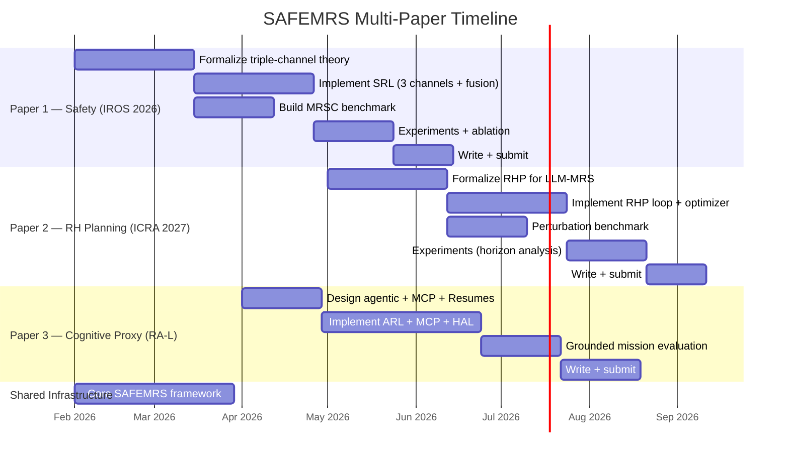

# SAFEMRS Project Plan: Complexity Evaluation, Simplification, and Multi-Venue Strategy

> Feasible action plan decomposing the current monolithic SAFEMRS proposal into focused, rigorous contributions for multiple venues — avoiding salami-slicing while managing implementability.

---

## 1. Complexity Diagnosis of the Current Proposal

### 1.1 Quantified Scope Inventory

The current architecture proposal claims **all** of the following as first-class contributions:

| # | Component | Sub-components | Novel? | Implementation Effort |
|---|-----------|---------------|--------|----------------------|
| 1 | Triple-Channel Safety (SRL) | Formal Logic (LTL/CTL/Deontic), LLM CoT (SafePlan-style), CBF Runtime Enforcement, Conformal Prediction Calibration, Corroborative Fusion | **Yes** (integration is new) | Very High |
| 2 | Agentic Reasoning Layer (ARL) | CoT decomposition, Workflow Composer, Agentic Loop with tool calls | Moderate (agentic LLM is trending) | High |
| 3 | MCP External Augmentation | Tool servers, External AI agents, Knowledge base | Moderate (MCP is new to MRS) | Medium |
| 4 | Abstract Planning Layer (8 backends) | PDDL, BT, DAG, HTN, STL, FSM, Code Gen, YAML | **No** (each exists; the abstraction layer is new) | Very High (×8) |
| 5 | Real-Time Monitoring (RTM + PEFA) | State Aggregator, Anomaly Detector, Re-planning Trigger | Incremental over DEXTER-LLM, LLM-CBT | High |
| 6 | Hardware Abstraction Layer (HAL) | ROS 1, ROS 2, gRPC, MAVLink, XRCE-DDS, VLA bridge | Systems contribution (not novel research) | Very High |
| 7 | Embodiment-Aware MRS | Robot Resumes (URDF parsing), Skill Ontology, Inter-robot comm | Moderate | Medium |
| 8 | VLA Execution Bridge | Symbolic plan → continuous motor tokens | **Yes** (unexplored in MRS context) | High |

### 1.2 Verdict: The Proposal Is **Too Complex**

> [!CAUTION]
> The current SAFEMRS proposal simultaneously claims **19 features across 16 heatmap columns** against 14 competitors. For a 6-page IROS paper, this guarantees one of two outcomes:
> 1. **Shallow coverage** — every component gets 3–4 sentences, nothing gets depth, reviewers reject for "tech report, not research paper."
> 2. **Unimplementable scope** — implementing 8 planning backends + 6 HAL adapters + triple-channel safety + PEFA monitoring + VLA bridge is a multi-year systems effort, not a paper timeline.

**Specific failure modes:**
- **8 planning backends**: Each backend requires its own generator, verifier integration, and executor. Implementing even 3 rigorously would take months. Claiming 8 without depth invites "vaporware" criticism.
- **6 HAL adapters**: This is an engineering/systems contribution, not a research one. IROS reviewers won't value this unless the paper's framing is "systems."
- **VLA bridge**: This alone is an active area of research (RT-2, Octo, OpenVLA). Claiming it as a sub-component trivializes it.
- **13 addressed gaps**: A 6-page paper addressing 13 gaps cannot go deep on any.

---

## 2. Simplification Strategy (Without Losing Rigor or Novelty)

### 2.1 Core Principle: "One Deep Idea per Paper"

> [!IMPORTANT]
> IROS/ICRA/RA-L reviewers want **depth on one novel idea** with sufficient implementation and evaluation. Each paper should have:
> - **One primary contribution** (theoretically grounded, empirically validated)
> - **One or two supporting contributions** (that enable the primary)
> - **A clear benchmark or evaluation** demonstrating the primary contribution

### 2.2 What to Cut vs. Keep for Each Paper

The key insight: the current proposal contains **three genuinely distinct research ideas** that happen to live in the same architecture. These should be separated into independent, non-overlapping papers targeting different venues — each with its own depth, evaluation, and contribution.

---

## 3. The Receding Horizon Planning (RHP) Idea — Analysis

### 3.1 Conceptual Mapping to SAFEMRS

The user's receding horizon / MPC-inspired idea maps naturally to the PEFA loop already present in the architecture:

```
┌──────────────────────────────────────────────────────────┐
│                 Receding Horizon Planning                 │
│                                                          │
│  MPC Analogy          ←→     SAFEMRS Mapping             │
│  ─────────────        ──     ──────────────              │
│  Model                ←→     World Model + Robot Resumes │
│                              + Knowledge Base (MCP)      │
│  Constraints          ←→     Safety Constraints          │
│                              (LTL/CBF/Conformal)         │
│  Solve (optimize)     ←→     ARL + SRL: Plan + Verify    │
│  Execute first step   ←→     Execute first action(s)     │
│  Observe outcome      ←→     RTM: Telemetry + Anomaly    │
│  Re-solve             ←→     Re-plan via PEFA loop       │
└──────────────────────────────────────────────────────────┘
```

### 3.2 Why This Is Strong

1. **Theoretical grounding**: MPC has decades of convergence and stability theory. Framing LLM-based multi-robot planning as a receding horizon problem gives it a **formal control-theoretic foundation** that pure LLM planning papers lack.
2. **Optimality**: MPC provides (locally) optimal solutions. The analogy suggests that at each step, the LLM-based planner should optimize over a finite horizon, providing near-optimal task allocation.
3. **Safety via constraints**: MPC naturally incorporates constraints — this integrates perfectly with the SRL. CBFs in particular are already used in MPC literature as constraint enforcement.
4. **Robustness to uncertainty**: Receding horizon inherently handles partial observability — you don't need a perfect long-horizon plan, just a good short-horizon one that gets re-evaluated with new observations.
5. **Computational tractability**: Instead of planning for the entire mission horizon (which may be intractable), you plan for N steps ahead and re-plan, making the problem tractable at each step.

### 3.3 Why This Is Differentiated

No existing LLM-based multi-robot planning paper frames the problem as receding horizon optimization. The closest works:
- **DEXTER-LLM**: Does online re-planning but without a formal horizon or optimality notion
- **LLM-CBT**: Closed-loop BTs re-plan reactively, but not in an MPC-like structured way
- **COHERENT**: PEFA loop is conceptually related, but not formalized as receding horizon
- **SAFER**: Uses CBFs (which are related to MPC constraints) but only for low-level control, not for task-level planning

### 3.4 Risks and Mitigations

| Risk | Mitigation |
|------|-----------|
| "LLM planning ≠ optimization" — LLMs don't solve optimization problems | Frame the LLM as the **model** that predicts plan quality; use a classical optimizer (MILP, LP) for the actual task allocation. The LLM provides the cost function and constraint representation. |
| Horizon length selection is non-trivial | Empirically evaluate different horizons (N=1,2,3,5,∞) and show the optimality-vs-computation tradeoff |
| Re-planning latency may be too high | Show that short horizons + caching + incremental re-planning keep latency acceptable |
| Convergence guarantees don't apply to LLM-based models | Acknowledge this honestly; provide empirical convergence analysis and connect to robust MPC literature |

---

## 4. Multi-Venue Decomposition (Avoiding Salami-Slicing)

### 4.1 Anti-Salami-Slicing Principle

> [!WARNING]
> **Salami-slicing** = publishing the same experiment with minor variations across multiple papers. This is unethical and detectable. Instead, each paper below addresses a **fundamentally different research question**, uses **different baselines**, targets **different audiences**, and would be independently valuable even if the others didn't exist.

### 4.2 Three-Paper Plan

The three papers share the SAFEMRS architectural vision but each tackles a **distinct, self-contained research problem**:

---

#### **Paper 1: Safe Multi-Robot Task Planning via Corroborative Multi-Channel Verification**

| Attribute | Detail |
|-----------|--------|
| **Venue** | **IROS 2026** (deadline ~Mar 2026) or **ICRA 2027** |
| **Core RQ** | Does corroborative multi-channel safety verification (formal + probabilistic + runtime) provide strictly better safety than any single or dual-channel approach? |
| **Primary Contribution** | The corroborative safety verification framework: formal proof that triple-channel fusion dominates subsets on a coverage-soundness Pareto frontier |
| **Supporting Contributions** | (1) Multi-Robot Safety Challenge benchmark (MRSC), (2) Conformal prediction calibration for cross-channel fusion |
| **What's IN** | SRL (triple-channel), basic ARL (CoT planner, no MCP needed), 2 planning backends (PDDL + BT), basic RTM for CBF monitoring |
| **What's OUT** | MCP, HAL (6 adapters), VLA bridge, Robot Resumes, 6 of 8 planning backends, Skill Ontology |
| **Baselines** | SafePlan, SAFER, S-ATLAS, VerifyLLM (each represents one safety channel) |
| **Evaluation** | MRSC benchmark (500+ scenarios across 7 hazard categories) + RoCoBench subset + ablation (triple vs. dual vs. single channel) |
| **Novelty** | Triple-channel fusion with theoretical guarantees — genuinely new |
| **Page budget** | 6 pages (IROS) or 8 pages (RA-L) |
| **Estimated effort** | 3–4 months |

**Why not salami-slicing**: This paper is entirely about **safety verification theory and evaluation**. It does not address planning formalism diversity, agentic reasoning, or hardware abstraction.

---

#### **Paper 2: Receding Horizon Planning for LLM-Based Multi-Robot Systems Under Partial Observability**

| Attribute | Detail |
|-----------|--------|
| **Venue** | **ICRA 2027** (deadline ~Sep 2026) or **CoRL 2026** |
| **Core RQ** | Can receding horizon (MPC-style) planning improve task success rate, optimality, and robustness under partial observability compared to open-loop LLM planning? |
| **Primary Contribution** | Formalization of LLM-based multi-robot planning as a receding horizon optimization problem with formal constraint satisfaction (CBF + LTL) |
| **Supporting Contributions** | (1) Horizon-length vs. optimality analysis, (2) Safety-constrained re-planning guarantees during horizon transitions |
| **What's IN** | ARL (planner + optimizer), SRL (CBF constraints + basic formal verification), RTM (observation → re-plan loop), 1–2 planning backends (PDDL or DAG) |
| **What's OUT** | Full triple-channel fusion (use simplified safety), MCP, HAL, VLA, 6+ planning backends, Robot Resumes |
| **Baselines** | DEXTER-LLM (online re-planning), COHERENT (PEFA), LLM-CBT (closed-loop BT), open-loop LLM planners (SMART-LLM, LaMMA-P) |
| **Evaluation** | (1) Optimality gap vs. full-horizon oracle, (2) Success rate under injected perturbations (partial observability), (3) Computation time vs. horizon length, (4) Safety maintenance during re-planning transitions |
| **Novelty** | **First formalization of LLM-based MRS planning as MPC / receding horizon** — connects LLM planning to control theory |
| **Page budget** | 6–8 pages |
| **Estimated effort** | 3–4 months |

**Why not salami-slicing**: This paper is about **planning under uncertainty with formal optimality analysis**. It does not deeply address multi-channel safety verification (uses simplified safety constraints). Different research question, different baselines, different evaluation metrics.

**Key formulation sketch:**

```
At each time step k:
  1. Observe: b_k = BeliefUpdate(b_{k-1}, observations_k)    // RTM
  2. Plan:   π*_k = argmin_{π} J(π, b_k, H)                  // ARL (H-step horizon)
                    s.t.  φ_LTL(π) = true                     // SRL formal channel
                          h_CBF(x, π) ≥ 0  ∀x in reachable   // SRL runtime channel
  3. Execute: Apply first action a*_k = π*_k(0)               // MRS
  4. Repeat from step 1

Where:
  - b_k    = belief state (fused observations from all robots)
  - H      = planning horizon (tunable)
  - J(·)   = cost function (LLM-estimated task completion cost)
  - φ_LTL  = LTL safety specification
  - h_CBF  = control barrier function constraints
```

---

#### **Paper 3: An Agentic Cognitive Proxy Architecture for Heterogeneous Multi-Robot Systems**

| Attribute | Detail |
|-----------|--------|
| **Venue** | **RA-L** (rolling, with IROS/ICRA presentation) — systems-focused journal |
| **Core RQ** | Does agentic reasoning with external tool augmentation (MCP) and embodiment-aware allocation (Robot Resumes) improve plan quality and generalization across heterogeneous robot teams? |
| **Primary Contribution** | The "cognitive proxy" architecture: an agentic LLM that mediates between human intent and heterogeneous robot execution through external grounding and embodiment-aware reasoning |
| **Supporting Contributions** | (1) MCP integration for grounded planning, (2) Robot Resumes from URDF for capability-aware allocation, (3) Multi-formalism planning (3 backends: PDDL, BT, Code), (4) HAL for middleware bridging |
| **What's IN** | ARL (full agentic loop + MCP), Robot Resumes, HAL (ROS 2 + MAVLink + gRPC — three adapters, not six), 3 planning backends, basic safety (simplified SRL) |
| **What's OUT** | Full triple-channel safety (use basic verification), VLA bridge (future work), RTM PEFA loop (simplified monitoring), conformal prediction |
| **Baselines** | COHERENT (no MCP), SMART-LLM (no MCP, no abstraction), AutoHMA-LLM (no MCP, no embodiment-awareness), RoCo (no external tools) |
| **Evaluation** | (1) Hallucination rate with/without MCP, (2) Task allocation quality with/without Robot Resumes, (3) Qualitative demo of missions impossible without external grounding, (4) Cross-middleware deployment demo |
| **Novelty** | First MCP-integrated, embodiment-aware agentic architecture for MRS |
| **Page budget** | 8 pages (RA-L) |
| **Estimated effort** | 4–5 months |

**Why not salami-slicing**: This paper is about **systems architecture and grounded reasoning**. Different research question (grounding + embodiment, not safety or optimality), different baselines, different evaluation. It's a systems paper, not a theory paper.

---

## 5. Non-Overlap Verification Matrix

| Dimension | Paper 1 (Safety) | Paper 2 (RH Planning) | Paper 3 (Cognitive Proxy) |
|-----------|:-:|:-:|:-:|
| **Primary research question** | Multi-channel safety verification | Receding horizon planning under uncertainty | Agentic grounded planning with embodiment awareness |
| **Theory type** | Decision-theoretic safety fusion | Control-theoretic (MPC) | Architecture / systems design |
| **Core evaluation metric** | Safety coverage, soundness, violation rate | Optimality gap, success under perturbation | Hallucination rate, allocation quality |
| **Baselines** | SafePlan, SAFER, S-ATLAS, VerifyLLM | DEXTER-LLM, COHERENT, LLM-CBT, SMART-LLM | COHERENT, SMART-LLM, AutoHMA-LLM, RoCo |
| **Benchmark** | MRSC (safety-focused) | Custom perturbation scenarios | MCP-grounded missions |
| **Shared infrastructure** | Basic ARL, 2 backends | Basic safety, 1–2 backends | Simplified safety |
| **Venue type** | Conference (theory + empirics) | Conference (theory + empirics) | Journal (systems + empirics) |

> [!NOTE]
> Each paper uses a **simplified version** of the other papers' core contributions as infrastructure. Paper 1 uses a basic planner; Paper 2 uses basic safety; Paper 3 uses basic safety and basic planning. **No paper presents the other's contribution as its own.** This is standard practice — papers build on shared infrastructure but contribute differently.

---

## 6. Timeline and Sequencing



### Recommended Order

1. **Paper 1 first** (IROS 2026, nearest deadline) — builds the safety core that other papers use as infrastructure
2. **Paper 2 second** (ICRA 2027) — adds receding horizon on top of the safety framework
3. **Paper 3 third** (RA-L, rolling) — adds the full systems architecture

> [!TIP]
> Papers 2 and 3 can be worked in parallel after Paper 1's core implementation is done, since they share foundational code but diverge in their research focus.

---

## 7. Simplified SAFEMRS for Paper 1 (Immediate Next Steps)

For the first and most urgent paper, the architecture shrinks dramatically:

### What stays:
- **SRL** (all 3 channels + corroborative fusion + conformal prediction) — this IS the paper
- **ARL** (basic CoT planner — no MCP, no agentic loop needed)
- **2 planning backends** (PDDL + Behavior Trees — enough to show generality)
- **Basic RTM** (CBF monitoring + simple anomaly detection)
- **2–3 robot types** (UAV + UGV sufficient)

### What goes to future papers:
- ~~MCP external tools~~ → Paper 3
- ~~8 planning backends~~ → reduce to 2
- ~~HAL (6 adapters)~~ → Paper 3
- ~~VLA bridge~~ → Paper 3 or future work
- ~~Robot Resumes~~ → Paper 3
- ~~Skill Ontology~~ → Paper 3
- ~~UUV + Quadruped~~ → Paper 3
- ~~Inter-robot communication mesh~~ → future work
- ~~XRCE-DDS, gRPC adapters~~ → Paper 3

This reduces the implementation from ~15 major components to ~5, making it feasible for a 3–4 month timeline.

---

## 8. Immediate Action Items

### Week 1–2 (Now)
- [ ] **Decide on Paper 1 target venue** (IROS 2026 vs. ICRA 2027) — check deadlines
- [ ] **Write the formal problem definition** for triple-channel corroborative safety verification
- [ ] **Define the MRSC benchmark specification** (7 hazard categories, scenario templates)
- [ ] Begin formalizing the RHP idea (Paper 2) in a separate notes document

### Week 3–6
- [ ] Implement the three SRL channels (formal logic, LLM CoT, CBF enforcement)
- [ ] Implement the corroborative fusion mechanism with conformal prediction
- [ ] Build the MRSC benchmark (start with 100 scenarios, scale to 500+)

### Week 7–10
- [ ] Run full experiments (triple vs. dual vs. single channel ablation)
- [ ] Compare against SafePlan, SAFER, S-ATLAS, VerifyLLM baselines
- [ ] Begin drafting Paper 1

### Week 11–14
- [ ] Paper 1 writing and internal review
- [ ] Begin Paper 2 formalization (RHP theory)
- [ ] Begin Paper 3 design (agentic architecture + MCP)

---

## 9. Summary

| Decision | Recommendation |
|----------|---------------|
| **Is the current proposal too complex?** | **Yes** — 19 features, 8 backends, 6 HAL adapters, 13 gaps addressed. Unimplementable in paper scope. |
| **Simplification strategy** | Decompose into 3 focused papers, each with ONE deep contribution |
| **Salami-slicing risk** | **Mitigated** — each paper has a different RQ, baselines, metrics, and venue type |
| **RHP/MPC idea** | **Strong** — provides formal control-theoretic grounding to LLM planning. Paper 2 candidate. |
| **Paper 1 focus** | Triple-channel corroborative safety verification (IROS 2026) |
| **Paper 2 focus** | Receding horizon planning for LLM-MRS under partial observability (ICRA 2027) |
| **Paper 3 focus** | Agentic cognitive proxy architecture with MCP + embodiment (RA-L) |
| **First priority** | Paper 1 — sharpen safety contribution, implement 3 channels, build MRSC benchmark |
