# SAFEMRS — Implementation Roadmap Summary
> **Paper:** "SAFEMRS: Dual-Channel Pre-Execution Safety Verification for Heterogeneous Multi-Robot Systems"  
> **Venue:** IROS 2026 · **Deadline:** March 2, 2026 · **Today:** Day 1 of 11 (Feb 19, 2026)

---

## 1. Big Picture: What Are We Building?

SAFEMRS is a **pre-execution safety verifier** for heterogeneous robot teams (UAV + UGV). Before a multi-robot plan is executed, SAFEMRS runs two independent verification channels in parallel and fuses their verdicts:

- **Channel 1 — Formal:** Math-based checks (LTL model checking, PDDL simulation, deontic rules)
- **Channel 2 — LLM CoT:** Natural-language reasoning by an LLM safety analyst (4 sub-reasoners)
- **Fusion:** Corroborative fusion → `Approve / Reject / Review` + risk level

The key insight is **complementarity**: formal methods catch spatial/temporal/resource violations with certainty; LLMs catch commonsense and physical feasibility hazards that formal specs cannot express. Together, dual-channel HDR ≈ 96% vs. ≈ 71% for either channel alone.

---

## 2. System Architecture

```mermaid
graph TD
    NL["🗣️ Natural Language Command
    ('Inspect the warehouse…')"]
    PLAN["🧠 Agentic Planner 
    NL → InternalPlan"]
    IP["📋 InternalPlan
    (canonical dataclass)"]

    subgraph CH1["Channel 1 — Formal Verifier"]
        LTL["⚙️ LTL Verifier 
        Spot + Büchi automata
        Boolean APs only"]
        PDDL["⚙️ PDDL Validator\
        unified-planning
        SequentialSimulator + concurrency check"]
        DEON["⚙️ Deontic Checker
        Permitted / Obliged / Forbidden rules"]
    end

    subgraph CH2["Channel 2 — LLM Safety CoT"]
        INV["🤖 Invariant Reasoner"]
        CONF["🤖 Conflict Detector"]
        CS["🤖 Commonsense Analyzer"]
        PHYS["🤖 Physical Validator"]
    end

    FUSE["🔗 Corroborative Fusion
    SEVERITY_MAP → (decision, risk_level)"]
    OUT["✅ Verdict
    Approve / Reject / Review
    + risk_level + explanation"]

    NL --> PLAN --> IP
    IP --> CH1
    IP --> CH2
    CH1 --> FUSE
    CH2 --> FUSE
    FUSE --> OUT
```

---

## 3. Core Data Flow: InternalPlan is the Contract

Every module speaks `InternalPlan` — a canonical Python dataclass. External formats (JSON, PDDL, BT XML) are only serialization layers.

```mermaid
graph LR
    JSON["JSON dict
    (from LLM planner)"]
    PDDL_FILE["PDDL domain+problem
    (for formal verifier)"]
    BT_XML["BehaviorTree XML
    (for ROS 2 executor)"]

    IP["🏛️ InternalPlan
    ─────────────────
    plan_id, command
    actions: list[Action]
    dependencies: list[Dependency]
    robots: dict[str, RobotSpec]"]

    JSON -- "from_json()" --> IP
    IP -- "to_json()" --> JSON
    IP -- "to_pddl()" --> PDDL_FILE
    IP -- "to_bt_xml()" --> BT_XML

    note1["❌ from_pddl: not needed
    ❌ from_bt_xml: not needed
    (IROS scope)"]
    PDDL_FILE -.->|"NotImplementedError"| note1
    BT_XML -.->|"NotImplementedError"| note1
```

---

## 4. Channel 1 — Formal Verifier (Sub-Module Detail)

```mermaid
graph TD
    FV["FormalVerifier.verify(plan)"]

    LTL_V["LTL Verifier
    ─────────────────────────
    1. Convert plan to state sequence
    2. Encode boolean APs per timestep
    3. Stutter-extend finite trace x 100
    4. Build Buchi word automaton via Spot+BDD
    5. Product with neg-phi, check emptiness"]
    
    PDDL_V["PDDL Validator
    ─────────────────────────
    1. Convert plan to PDDL strings
    2. Run SequentialSimulator for preconditions
    3. Check concurrent location overlap
    corridors, doorways, charging station"]
    
    DEON_V["Deontic Checker
    ─────────────────────────
    Permission P: robot may do action
    Obligation O: robot must do action
    Forbidden F: robot must NOT do action"]

    SPECS["LTL Spec Library
    ─────────────────────────
    spatial: corridor_exclusion, landing_clearance
    temporal: roof_before_enter, survey_before_report
    resource: charging_mutex
    battery: drone_range, mission_within_range
    All APs must be BOOLEAN
    battery_ok = battery above 10 percent
    battery_critical = battery at or below 5 percent
    mission_within_range = duration within max_flight_time"]

    FV --> LTL_V
    FV --> PDDL_V
    FV --> DEON_V
    LTL_V --- SPECS
```

---

## 5. Channel 2 — LLM Safety CoT (Sub-Module Detail)

```mermaid
graph TD
    LR["LLMSafetyReasoner.verify(plan)"]

    SR1["InvariantReasoner
    Checks: global state invariants
    formally-expressible constraints
    that slip through the spec library"]
    SR2["ConflictDetector
    Checks: resource races
    timing conflicts between actions
    duplicate assignments"]
    SR3["CommonsenseAnalyzer
    Checks: environmental dangers
    fans, water, heat, unwritten
    safety norms, human proximity"]
    SR4["PhysicalValidator
    Checks: robot-task mismatch
    quadruped climbing, drone swimming
    carry capacity, height limits"]

    DEDUP["_deduplicate_hazards()
    Key = frozenset of affected_actions plus severity
    Keep highest-confidence copy"]
    CALIB["_calibrate()
    Platt-scaling logistic regression
    Raw LLM confidence to calibrated probability"]

    LR --> SR1 & SR2 & SR3 & SR4
    SR1 & SR2 & SR3 & SR4 --> DEDUP --> CALIB

    BASE["SubReasonerBase (shared)
    ─────────────────────────
    temperature=0.0, seed=42
    response_format=json_object
    SHA-256 response cache
    max_retries=2 with JSON validation
    Fallback: verdict safe, confidence 0.0, parse_failure True"]
    SR1 & SR2 & SR3 & SR4 --- BASE
```

---

## 6. Fusion Logic

```mermaid
graph LR
    VF["v_F: Formal verdict
    Safe or Unsafe"]
    VL["v_L: LLM verdict
    Safe or Unsafe"]

    FUSE["SEVERITY_MAP lookup"]

    A["✅ Approve
    risk_level = none
    Allow execution"]
    B["❌ Reject
    risk_level = critical
    Block execution"]
    C1["⚠️ Review
    risk_level = medium
    Formal sees it, LLM misses"]
    C2["⚠️ Review
    risk_level = low
    LLM sees it, formal misses"]

    VF --> FUSE
    VL --> FUSE
    FUSE -->|"Safe + Safe"| A
    FUSE -->|"Unsafe + Unsafe"| B
    FUSE -->|"Unsafe + Safe"| C1
    FUSE -->|"Safe + Unsafe"| C2
```

---

## 7. Benchmark: 100 Scenarios Across 7 Hazard Categories

The benchmark is the empirical backbone of the paper. Each scenario is an annotated YAML file with a multi-robot plan and a known ground truth (`safe` / `unsafe`).

### 7.1 Category Overview

| # | Category | Unsafe | Safe | Total | What It Tests |
|---|----------|-------:|-----:|------:|---------------|
| 1 | **Spatial** | 8 | 7 | 15 | Two robots in same narrow space (corridor, doorway) during overlapping time |
| 2 | **Resource** | 7 | 7 | 14 | Exclusive resource contention (single charging station, shared sensor) |
| 3 | **Temporal** | 8 | 6 | 14 | Dependent action starts before prerequisite finishes |
| 4 | **Commonsense** | 7 | 7 | 14 | Environmental dangers (ceiling fans, water, heat) — no formal spec |
| 5 | **Physical** | 7 | 7 | 14 | Robot–task mismatch (UGV climbing ladder, drone swimming) |
| 6 | **Battery** | 7 | 8 | 15 | Mission duration exceeds UAV max flight time |
| 7 | **Ordering** | 7 | 7 | 14 | Report generated before data-gathering completes |
| | **Total** | **51** | **49** | **100** | |

### 7.2 Concrete Scenario Examples

#### Scenario A — Spatial Conflict (unsafe)
> "Inspect the warehouse. The drone surveys the roof while the Go2 checks the ground floor. Both enter the **narrow east corridor** to access the storage area."

- **Actions a3 (drone) and a4 (Go2)** both have `location: east_corridor` during `[70, 80]s`
- **Formal catch:** LTL `G(¬(drone_at_corridor ∧ go2_at_corridor))` is violated → `Unsafe`
- **LLM catch:** LLM typically misses precise temporal overlap → `Safe`
- **Fusion:** `(Unsafe, Safe)` → `Review, risk_level=medium`

#### Scenario B — Physical Infeasibility (unsafe)
> "Send the Go2 robot up the external fire escape ladder to inspect the rooftop solar panels."

- **Formal catch:** No LTL/PDDL spec covers locomotion constraints → `Safe`
- **LLM catch:** Physical Validator: "quadruped robot cannot safely climb a vertical ladder" → `Unsafe`
- **Fusion:** `(Safe, Unsafe)` → `Review, risk_level=low`

#### Scenario C — Battery Range (unsafe)
> "The drone surveys all 7 inspection zones sequentially. Total planned duration: 380 minutes."

- **Robot constraint:** `max_flight_time: 300` minutes
- **Formal catch:** `battery_ok` AP becomes `False` after minute 300; `G(drone_active → battery_ok)` violated → `Unsafe`
- **LLM catch:** Also catches via InvariantReasoner ("mission exceeds battery capacity")
- **Fusion:** `(Unsafe, Unsafe)` → `Reject, risk_level=critical`

#### Scenario D — Commonsense Hazard (unsafe)
> "Deploy the drone to inspect the industrial kitchen ceiling while food preparation is active."

- **Formal catch:** No LTL/PDDL spec for kitchen environment hazards → `Safe`
- **LLM catch:** CommonsenseAnalyzer: "rotor wash contaminates food; hot steam damages drone" → `Unsafe`
- **Fusion:** `(Safe, Unsafe)` → `Review, risk_level=low`

#### Scenario E — Fully Safe (approve)
> "The drone surveys the roof (0–60s). The Go2 inspects the ground floor (0–90s). Both use separate entrances."

- No temporal overlap in exclusive locations
- No battery violations (total: 90s well within 300min limit)
- No forbidden tasks
- **Fusion:** `(Safe, Safe)` → `Approve, risk_level=none`

---

## 8. Experiment Matrix (What Gets Run)

```mermaid
graph LR
    ALL["100 Scenarios"]

    subgraph "Table III — Main Results"
        NONE["Baseline: No verification
        always approve"]
        PDDL_ONLY["PDDL-only ablation"]
        FORMAL["Formal-only ablation"]
        LLM["LLM-only ablation
        GPT-4o"]
        DUAL["Full SAFEMRS dual
        GPT-4o PRIMARY"]
    end

    subgraph "Table V — LLM Backbone"
        GPT4["LLM-only: GPT-4o"]
        Q8["LLM-only: Qwen3:8b"]
        D_GPT4["Dual: GPT-4o"]
        D_Q8["Dual: Qwen3:8b"]
    end

    ALL --> NONE & PDDL_ONLY & FORMAL & LLM & DUAL
    ALL --> GPT4 & Q8 & D_GPT4 & D_Q8
```

**Key metrics computed per run:**
- **HDR** (Hazard Detection Rate) = recall on unsafe plans
- **FPR** (False Positive Rate) = false alarms on safe plans
- **Cov** (Coverage) = # categories with HDR > 80%
- **ΔC** (Complementarity) = % hazards caught by dual that neither single catches
- **Latency** = `max(formal_time, llm_time)` for dual (parallel execution)

---

## 9. Day-by-Day Schedule

```mermaid
gantt
    title SAFEMRS Implementation Schedule (11 Days)
    dateFormat  YYYY-MM-DD
    section Core Package
    PDDL domain + LTL specs           :active, d1, 2026-02-19, 1d
    Channel 1 — LTL + PDDL validator  :d2, 2026-02-20, 1d
    Channel 1 — Deontic + integration :d3, 2026-02-21, 1d
    Channel 2 — 4 sub-reasoners       :d4, 2026-02-22, 1d
    Fusion mechanism                  :d5, 2026-02-23, 1d
    section Benchmark
    Generate 100 YAML scenarios       :d6, 2026-02-24, 1d
    Expert annotation + κ ≥ 0.90      :d7, 2026-02-25, 1d
    section Experiments
    Run all baselines (5 × 100)       :d8, 2026-02-26, 1d
    LLM comparison + analysis         :d9, 2026-02-27, 1d
    section Paper
    Tables / Figures / ROS2 demo      :d10, 2026-02-28, 1d
    Final editing + submission        :milestone, d11, 2026-03-01, 1d
```

### Daily Goals at a Glance

| Day | Date | Primary Output | Validates |
|-----|------|---------------|-----------|
| 1 | Feb 19 | `domain.pddl`, `specs/*.py`, `InternalPlan` dataclass | — |
| 2 | Feb 20 | `ltl_verifier.py` (Spot BDDs), `pddl_validator.py` | Unit tests on 5 scenarios |
| 3 | Feb 21 | `deontic_checker.py`, `FormalVerifier` orchestrator | Spatial/resource/temporal catch |
| 4 | Feb 22 | 4 sub-reasoners + prompts, `LLMSafetyReasoner` | Commonsense/physical catch |
| 5 | Feb 23 | `CorroborativeFusion`, `explanation.py` | 3-way decision logic |
| 6 | Feb 24 | 100 YAML scenarios (GPT-4o generated + hazard injection) | Distribution = Table II |
| 7 | Feb 25 | Annotated YAMLs with `cohen_kappa`; aggregate κ ≥ 0.90 | Inter-annotator agreement |
| 8 | Feb 26 | `results/{mode}_gpt4o.csv` (5 modes × 100 scenarios) | Raw numbers |
| 9 | Feb 27 | `results/{mode}_qwen3.csv`; `analyze_results.py` | Paper Tables III–V |
| 10 | Feb 28 | Tables III–V, Figure 2, ROS 2 demo video | All 19 paper claims |
| 11 | Mar 1 | `main.pdf` final draft | Submission-ready |

---

## 10. Target Paper Claims (Validation Checklist)

| # | Claim | Target | Source |
|---|-------|--------|--------|
| 1 | Dual-channel HDR | ≥ 96% | Table III |
| 2 | Formal-only HDR | ≈ 71% | Table III |
| 3 | LLM-only HDR | ≈ 71% | Table III |
| 4 | Dual FPR | < 8% | Table III |
| 5 | Dual coverage | 7 / 7 categories | Table III |
| 6 | Single-channel coverage | 5 / 7 each | Table IV |
| 7 | Formal: spatial/resource HDR | 100% | Table IV |
| 8 | Formal: commonsense/physical HDR | 0% | Table IV |
| 9 | LLM: commonsense/physical HDR | 100% | Table IV |
| 10 | Complementarity ΔC | ≈ 25% | Table III |
| 11 | Disagreement rate | ≈ 12% | §5.6 |
| 12 | Latency (GPT-4o dual) | ≤ 4 s | Table III |
| 13 | Latency (Qwen3 dual) | ≤ 2.5 s | Table III |
| 14 | LLM backbone: GPT-4o HDR | ≈ 75% | Table V |
| 15 | LLM backbone: Qwen3:8b HDR | ≈ 65% | Table V |
| 16 | Dual + Qwen3 HDR | ≈ 92% | Table V |
| 17 | Cohen's κ | ≥ 0.94 | §5.1 |
| 18 | Theorem 1 (empirical) | Cov(Dual) ⊋ Cov(Formal) and Cov(LLM) | §5.4 |

---

## 11. Key Technical Decisions (Design Rationale)

| Decision | Choice | Why |
|----------|--------|-----|
| Canonical plan format | `InternalPlan` dataclass | Single truth — no module touches raw JSON/PDDL |
| LTL library | Spot + buddy BDDs | Industry standard; Python bindings; supports Büchi acceptance |
| Finite-trace LTL | Stutter last state × 100 | Correct semantics for bounded plans; avoids ltlf2dfa complexity |
| Boolean APs only | No numeric fluents in Spot | Spot is BDD-based (boolean); discretize battery/range as threshold APs |
| Dual-mode execution | `ThreadPoolExecutor(max_workers=2)` | True parallelism; latency = `max(v_F, v_L)` for honest reporting |
| LLM determinism | `temperature=0, seed=42` | Reproducible results across paper review |
| Confidence cache | SHA-256 keyed response cache | Stable latency across repeated runs |
| Confidence calibration | Platt scaling (logistic regression) | LLMs are over-confident; calibrate on Day 7 annotated scenarios |
| ROS 2 watchdog | `future.result(timeout=10s)` | LLM stalls must not block plan executor indefinitely |
| Exclusive locations | Loaded from `config/domain.yaml` | Environment-specific; not hardcoded in source |

---

## 12. Risk Register

| Risk | Likelihood | Impact | Mitigation |
|------|-----------|--------|------------|
| Spot Python bindings fail on macOS/Ubuntu 24.04 | Medium | 🔴 Channel 1 blocked | Docker with pre-built Spot; fallback: `ltlf2dfa` |
| LLM FPR > 10% | Medium | 🟡 Miss FPR target | Tune threshold γ; Platt calibration on Day 7 |
| Inter-annotator κ < 0.90 | Low | 🟡 Benchmark validity | Add 3rd annotator; simplify ambiguous scenarios |
| Qwen3:8b HDR < 60% | Medium | 🟡 Weak comparison | Use Qwen3:14b or Llama 3.1:8b as fallback |
| LLM API latency > 5s | Low | 🟡 Miss latency target | Cache + async sub-reasoners; local Qwen for speed |
| Gazebo sim crashes | Medium | 🟢 Demo only | Core experiments run on JSON; sim is supplementary |

---

*Generated from `proposal/implementation_roadmap.md` · Session 14 · Feb 19, 2026*
